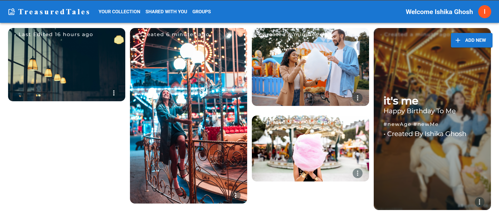

# TreasuredTales: Preserve and Share Your Stories Together

TreasuredTales is a captivating web app designed to help you store, share, and cherish your most treasured memories and stories with others. With TreasuredTales, you can create a virtual space where you can store your memories, whether it's a heartwarming anecdote, a significant milestone, or a memorable adventure. The app allows you to connect and collaborate with other users by creating groups, enabling you to share and celebrate common memories together. TreasuredTales serves as a digital vault to safeguard your precious tales while fostering a sense of community and togetherness. Let TreasuredTales be the platform where your stories find their place, creating lasting connections and preserving the legacy of shared experiences.

## [TreaturedTales](https://treasured-tales-5998.vercel.app/)

## Table of Contents

1. [Getting Started](#getting-started)
2. [Features](#features)
   1. [User Registration and Authentication](#1-user-registration-and-authentication)
   2. [Creating and Managing Memories](#2-creating-and-managing-memories)
   3. [Sharing your memories with others with controlled access](#3-sharing-your-memories-with-others-with-controlled-access)
   4. [Group Creation and Collaboration](#4-group-creation-and-collaboration)
3. [Privacy and Security](#privacy-and-security)
4. [Tech Stack](#tech-stack)

## Getting Started

To get started with TreasuredTales, follow these steps:

- Visit **[treasuredtales](https://treasured-tales-5998.vercel.app/)** in your web browser.
- If you are a new user, click on the **"Sign Up"** button to create a new account. If you are an existing user, click on **"Log In"** to access your account.
- Once logged in, you will be directed to your dashboard, where you can begin creating and managing your memories.

## Features

### 1. User Registration and Authentication

- New users can register by providing their name, unique **email address, and password**.
- Existing users can log in using their registered credentials.
- Passwords are securely hashed and stored to ensure user account security.

### 2. Creating and Managing Memories

- Users can create and store memories by providing a title, date, description, and media (photos).
- They can also update or edit the provided data whenever they want.
- Users can edit, and delete the details of their stored memories.

### 3. Sharing your memories with others with controlled access

- Users can share their created memories with others with limited access.
- You can also restrict access by mentioning Editing or Viewing access at the time of sharing.
- Users can also see the posts that have been shared with them in one place
- They can also add to their favorites any particular post.
- They can also filter the posts with respect to their access to those memories.

### 4. Group Creation and Collaboration

- Users can create groups and add other members to that group.
- The admin of the group can give access to specific members to Create Memories in that group.
- Group members can share their memories within the group, creating a shared collection of cherished experiences.
- The members who have access to the group can also share their previously created memories.
- Admin can remove other members from the group and also delete the group.

## Privacy and Security

TreasuredTales takes privacy and security seriously. Here are some key points:

- User passwords are securely **hashed** and never stored in plaintext.
- User data and memories are encrypted to protect against **unauthorized** access.
- Users can control the privacy settings of their memories and groups, choosing to make them public, private, or shared with specific users.

### Tech Stack:

